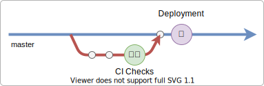

# Junior Senior #13: CI/CD w GitHub Actions

Repozytorium zawiera kod źródłowy przykładowej aplikacji Next.js, dla której zdefiniowano procedury CI/CD wykonywane poprzez GitHub Actions:

1. CI: weryfikacja jakości kodu (linting, testy, budowanie)
2. CD: Automatyczny deployment kodu z brancha `master` na GitHub Pages.

## Continuous Integration

Procedura uruchamiana dla Pull Requestów (utworzenie oraz dodanie commitów), która:

1. Pobiera zależności aplikacji
2. Analizuje kod przy użyciu `eslint` i `prettier`a
3. Uruchamia testy
4. Buduje aplikację next.js

## Continuous Deployment

Procedura uruchamiana dla commitów na brancha `master`, która wdraża nową wersję aplikacji na środowisko w GitHub Pages:

1. Pobiera zależności aplikacji
2. Ustawia [`basePath`](https://nextjs.org/docs/api-reference/next.config.js/basepath) aplikacji next.js
3. Dodaje plik [.nojekyll](https://github.blog/2009-12-29-bypassing-jekyll-on-github-pages/)
4. Buduje aplikację i eksportuje do statycznych plików (`next export`)
5. Wdraża zbudowaną aplikację na GitHub Pages (commituje na branch `gh-pages`)
